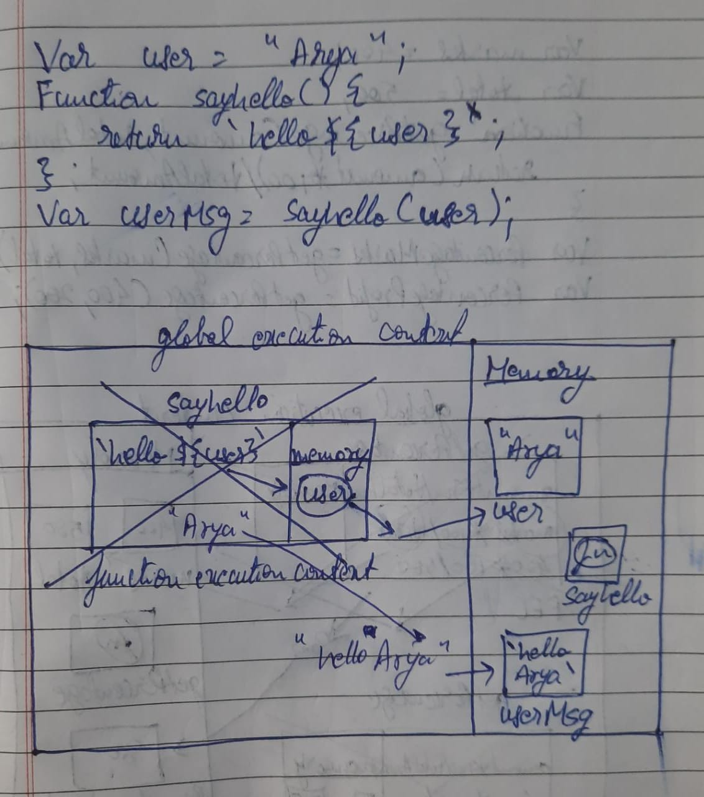
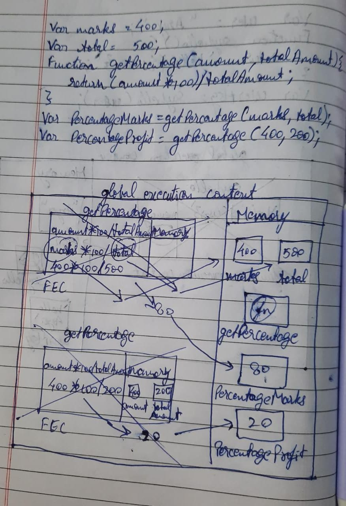
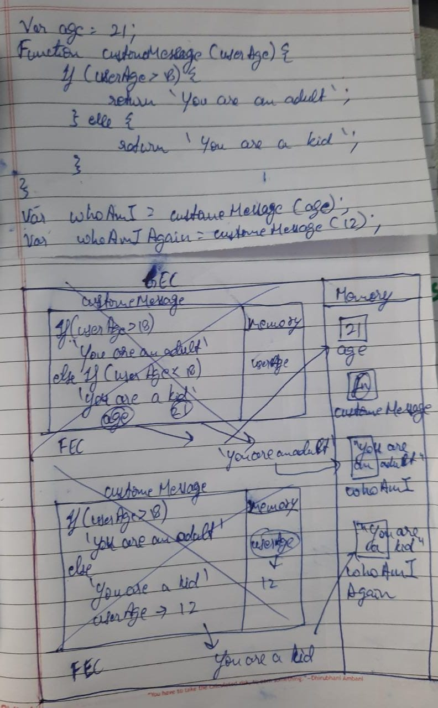

1. What does thread of execution means in JavaScript?
//thread of execution means that the javascript engine will read and execute the code line by line

2. Where the JavaScript code gets executed?
//global execution context

3. What does context means in Global Execution Context?
//it is area which shows the execution of the programs

4. When do you create a global execution context.
//when there will be some lines of code then the javascript engine will create the global execution context

5. Execution context consists of what all things?
//a memoryspace to store data and a space for the execution of function in which function execution context has function execution is created which consit of function execution space and memory 

6. What are the different types of execution context?
//global execution context
//function execution context

7. When global and function execution context gets created?
//global is created only once per program while function is created for every function

8. Function execution gets created during function execution or while declaring a function.
//function execution

9. Create a execution context diagram of the following code on your notebook. Take a screenshot/photo and store it in the folder named `img`. Use `` to display it here.


```js
var user = "Arya";

function sayHello(){
  return `Hello ${user}`;
}

var userMsg = sayHello(user);
```

<!-- Put your image here -->



```js
var marks = 400;
var total = 500;

function getPercentage(amount, totalAmount){
  return (amount * 100) / totalAmount;
}

var percentageMarks = getPercentage(marks, total);
var percentageProfit = getPercentage(400, 200);
```

<!-- Put your image here -->



```js
var age = 21;

function customeMessage(userAge){
  if(userAge > 18){
    return `You are an adult`;
  }else {
    return `You are a kid`;
  }
}

var whoAmI = customeMessage(age);
var whoAmIAgain = customeMessage(12);
```

<!-- Put your image here -->

